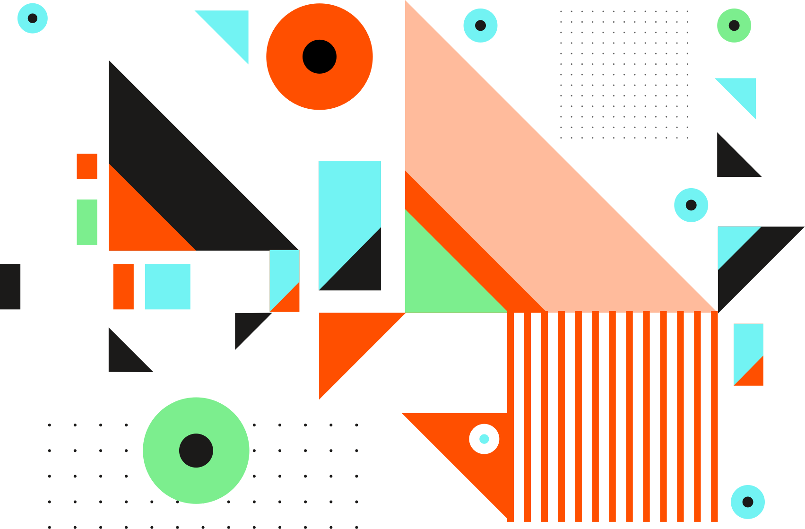

# Ceramic overview

Welcome to Ceramic developer documentation. Whether you want to [install Ceramic]() in your project, [run a node]() or just [learn the basics](), this site has the tools and resources for you. First, let's explore the high-level features, capabilities, and design of Ceramic.

## Document-based data model

On Ceramic, every piece of content is modeled as a mutable [document](learn/documents/document-model.md). These documents can represent almost any type of information and behave similar to your favorite NoSQL database.

## DID-based user model

Ceramic relies on [DIDs](learn/dids/specification.md) for user accounts. DIDs are used to authenticate transactions on documents and give users true control of their data.

## Verifiable information

Authenticated, schema-enforced, consensus over state, strong security. conflict resolution.

## Worldwide/Public dataweb

These documents can reference other documents to form a decentralized graph of linked information that lives beyond any silo. Beyond silos. Worldwide graph of information

## Decentralized network

Collection of [nodes](learn/network/nodes.md) all over the world that communicate over a peer-to-peer network. Is not reliant on a single server, nodes are not reliant on a supercomputer to run, designed for efficiency and scale to support all environments incl. resource constrained environments, this helps keep the network decentralized and resistant to the centralizing effects of resource demanding infrastructure. All aspects of the protocol are decentralized, from networking and communicatino using libp2p, to storage using IPFS, to document mutations and consensus being handled with the protocol.

## Flexible design

Layered approach to protocol design,many aspects of the system are modular, so it can be cofigured to your use case, for example which [DID method]() is used, how [document persistence]() is handled, consensus rules for documents, etc.

## Learn More

- [Documents](learn/documents/document-model.md)
- [Network](learn/network/clients.md)
- [DIDs](learn/dids/specification.md)

 
 
 